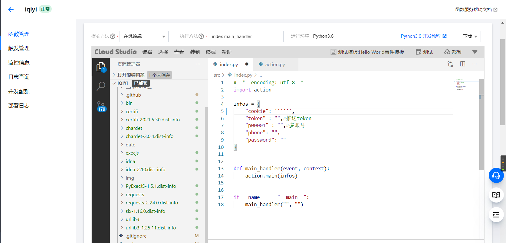
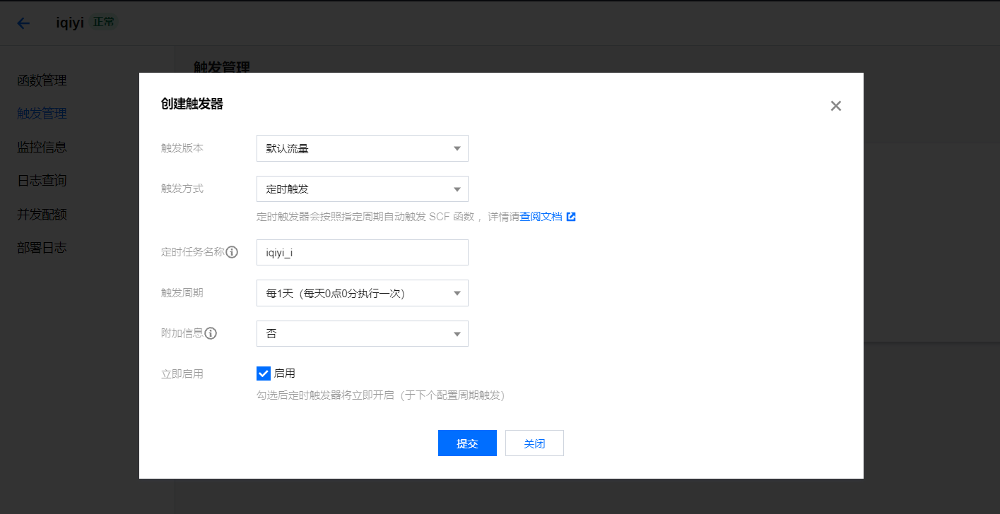

部署
---

### 下载仓库

```
git clone https://github.com/ioutime/Aiqiyi_Sign.git
```

### 创建云函数

1. 打开[腾讯云官网](https://cloud.tencent.com/)，登录，在产品中找到云函数入口

2. 进入**云函数**管理控制台，在函数服务中新建云函数，基础设置：

   ​	创建方式： 选择自定义

   ​	基础配置默认

   ​	函数代码：

   ​				提交方式选择：本地文件夹上传

   ​				上传：选择你刚刚下载下来的代码（Aiqiyi_Sign文件夹）

   ​				

3. 将高级配置中的环境配置-内存改为 64MB，执行超时时间改为 900，其他默认不改动，点击创建

### 配置云函数

1. 创建完成后进入函数管理页面，在在线 IDE 中打开一个终端：

   

2. 在终端中执行如下指令安装依赖：

   ```
   cd src/ && pip3 install -r requirements.txt -t .
   ```

3. 依赖安装完毕之后可以看到左侧目录项多出了很多文件夹，说明依赖安装成功

4. 修改*index.py*文件，将其中的`infos`变量各值修改为脚本所需参数（参数说明见 README），除**cookie**外其余参数可选填，**不需要的参数请不要取消注释！**

   

5. 所有项目修改完成后，点击部署：

   

### 测试

部署成功即可测试，测试时间可能有些长（几分钟），如结果没有问题，可以进行下一步，否则进行错误排查


### 配置触发器

在触发管理-创建触发器中按下图填写（定时任务名称使用默认即可）：



其中触发周期可以自定义，选择自定义出发周期可以使用 Cron 表达式创建，最后点击提交即可。

